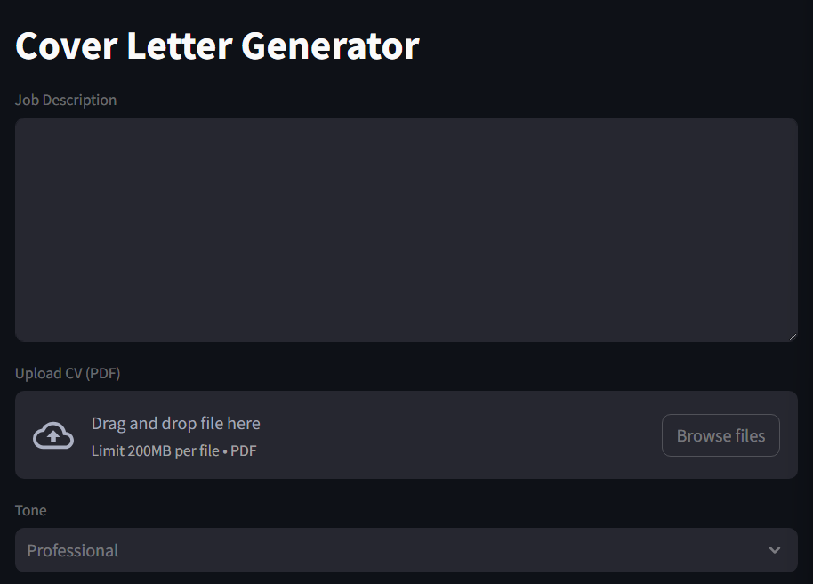

# Project Overview

This project is a Streamlit application that uses OpenAI's GPT-4 model to generate a cover letter based on a job description, a CV, and a selected tone (Professional, Friendly, or Neutral). The cover letter is generated in LaTeX format.



## Test the App
[Link to the app](https://gptcvmaker.streamlit.app)

## Prerequisites

- Python 3.6 or higher
- Streamlit
- OpenAI
- PyPDF2

## Installation

1. Clone the repository.
2. Install the required packages using pip:

```bash
pip install streamlit openai PyPDF2
```

## Usage

1. Set up your OpenAI API key. Uncomment the line `openai.api_key = ''` and replace the empty string with your API key.
2. Run the Streamlit app:

```bash
streamlit run main.py
```

3. In the Streamlit interface, upload your CV in PDF format, input the job description, select the tone, and provide the LaTeX template.
4. Click the "Generate" button to generate the cover letter.

## Functionality

The main function, `generate_cover_letter(job_description, cv_file, tone, template)`, takes in four parameters:

- `job_description`: A string containing the job description.
- `cv_file`: A PDF file containing the CV.
- `tone`: A string indicating the tone of the cover letter (Professional, Friendly, or Neutral).
- `template`: A string containing the LaTeX template for the cover letter.

The function reads the CV, generates a prompt for the GPT-4 model based on the job description, CV, and selected tone, and then calls the OpenAI API to generate the cover letter.

## Contributing

Contributions are welcome. Please submit a pull request.

## License

This project is licensed under the terms of the MIT license.